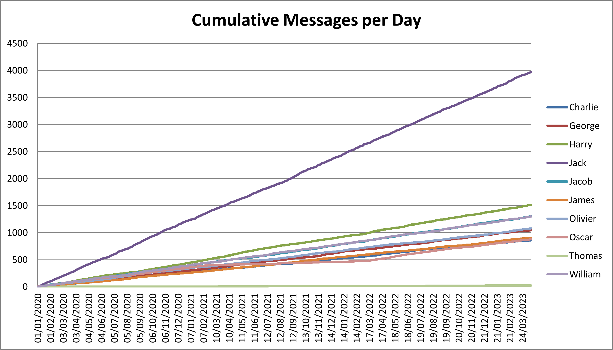
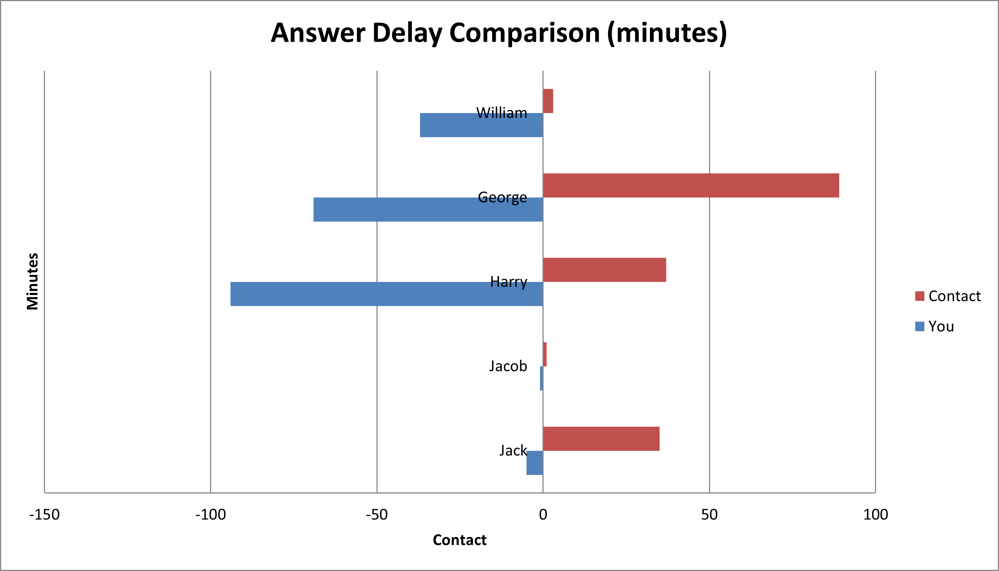
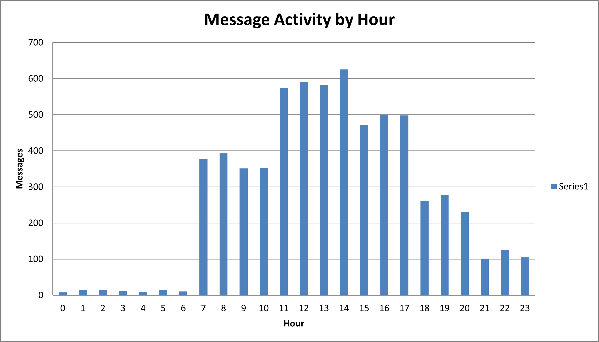
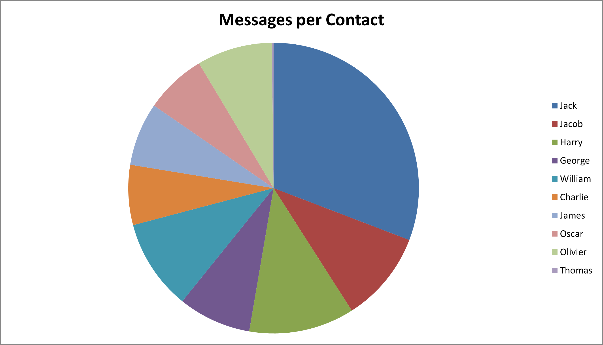

# 📊 SocialStats

**SocialStats** is a tool that analyzes your personal data from various social networks to provide **clear and visual statistics** about your online interactions.
It aggregates, merges, and visualizes advanced stats (response delay, activity over time, call durations, etc.) into **Excel graphs** that are easy to read and understand.

---

## 🧩 Features

* 📅 See how many messages you sent and received over time
* ⏱️ Measure your average response delay and your contacts’ (Instagram, Snapchat, WhatsApp)
* 🕐 View your activity by **hour**, **day**, **week**, **month**, or **year**
* 📞 Get your total voice call time (Discord only)
* 🎙️ See your total voice message time (Instagram, Snapchat)
* 📊 Compare how much you interact with different people
* 📦 Merge all your networks into a **single unified Excel file**

> [!TIP]
> Don’t forget to check the **"Global"** sheet in the Excel file — it contains more specific and aggregated information.

> [!WARNING]
> Too many contacts = unreadable Excel.
> The program will ask you to define a **minimum number of messages per conversation** so only relevant ones are included.

---

## 🛠️ Requirements

- [Python 3.10+](https://www.python.org/downloads/)
- [pip](https://pip.pypa.io/en/stable/installation/)
- [Excel](https://www.microsoft.com/en-us/microsoft-365/excel) or [LibreOffice](https://www.libreoffice.org/)

---

## 🚀 Setup & Run

### 🔵 On Windows

```
python setup.py
.venv\Scripts\activate
python main.py
```

### 🟢 On Linux / macOS

```
python3 setup.py
source .venv/bin/activate
python3 main.py
```

> [!WARNING]
> If you encounter any bug, please open an **issue** and explain the problem in detail — so I can fix it quickly.

---

## 🗂️ How to download your data

### 🟣 Discord *(can take up to 30 days)*

1. Go to ⚙️ Settings > **Data & Privacy**
2. Click **Request all of my data**
3. Select **everything**

### 🟠 Instagram *(takes less than 1 hour)*

1. Go to **Settings > Account Center**
2. Choose **Your information and permissions**
3. Click **Download your information**
4. Options:

   * Date range: **All time**
   * Format: **JSON**
   * Media quality: **High**

### 🟡 Snapchat *(can take up to 1 day)*

1. Go to **Settings > My Data**
2. Select everything, especially **Export JSON files**
3. Choose **All time** as period

### 🟢 WhatsApp *(instant)*

1. Open a conversation
2. Tap `⋮ > More > Export Chat`
3. Choose **Without media**

---

## 🧪 JSON Export *(in development)*

Standard export of all your conversations in a **clean and unified JSON format**.
Useful for re-importing, cross-platform comparisons, or visualizations.

---

## 🖼️ Media Export *(in development)*

Automatically export all **images** and **videos** from supported platforms into a single folder.

---

## 📷 Example outputs

<table>
  <tr>
    <td></td>
    <td></td>
  </tr>
  <tr>
    <td></td>
    <td></td>
  </tr>
</table>

---

## 📄 License

This project is licensed under the **MIT License**.
Feel free to fork or reuse — just make sure to **credit [Antrubtor](https://github.com/Antrubtor)**.

---